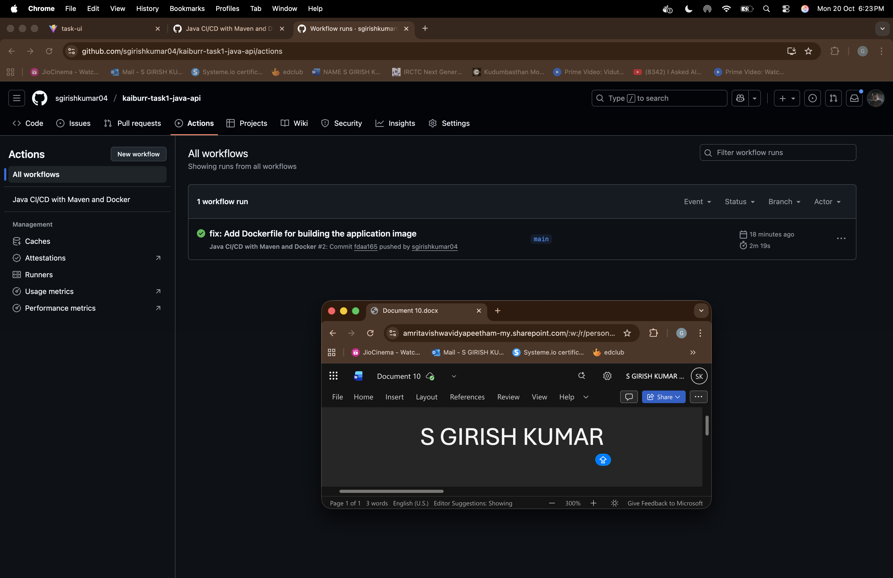

# Kaiburr Task 4: CI/CD Pipeline Implementation

This repository contains the submission for Task 4. It documents the CI/CD pipeline built using **GitHub Actions** to automate the build and deployment of a Docker image for the Java REST API from Task 1.

---

### Pipeline Location and Trigger

-   **Source Code Repository:** The pipeline is configured to run on the [kaiburr-task1-java-api](https://github.com/<your-github-username>/kaiburr-task1-java-api) repository.
-   **Trigger:** The workflow is automatically triggered on every `push` event to the `main` branch of that repository.

---

### Pipeline Stages

The pipeline consists of a single job that performs the following steps in sequence:

1.  **Checkout Code**: Downloads the latest source code from the `main` branch.
2.  **Set up JDK 17**: Configures the runner environment with the required Java version.
3.  **Build with Maven**: This is the **Code Build** step. It compiles the Java application and packages it into an executable `.jar` file using the `mvn clean package` command.
4.  **Log in to Docker Hub**: Securely authenticates with Docker Hub using `DOCKERHUB_USERNAME` and `DOCKERHUB_TOKEN` stored as GitHub Secrets.
5.  **Build and Push Docker image**: This is the **Docker Build** step. It builds a new Docker image using the `Dockerfile` in the source repository and pushes the image to Docker Hub, tagging it as `latest`.

---

### Pipeline as Code

The complete code for this pipeline is defined in the following file within this repository:
[`./.github/workflows/build-and-push.yml`](./.github/workflows/build-and-push.yml)

---

### Proof of Successful Execution

The screenshot below shows a successful run of the CI/CD pipeline in the GitHub Actions console. It confirms that all stages, including the code build and Docker push, completed without errors.

**Screenshot taken with my name and current date/time visible:**

